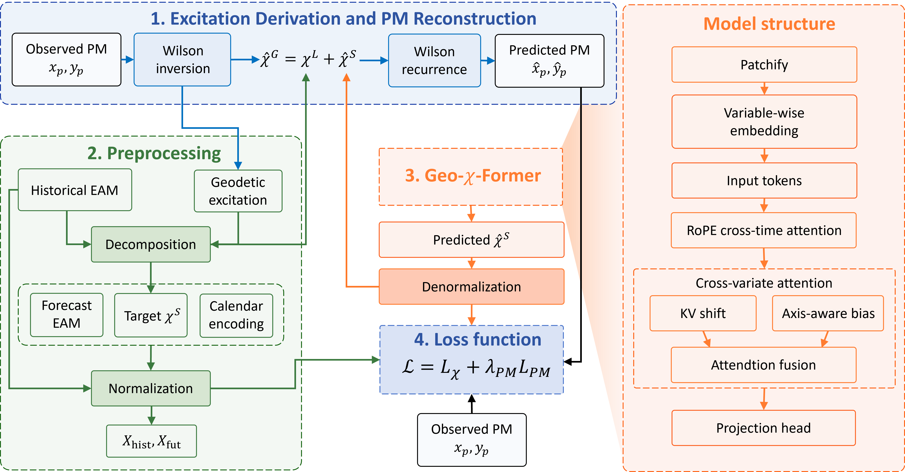
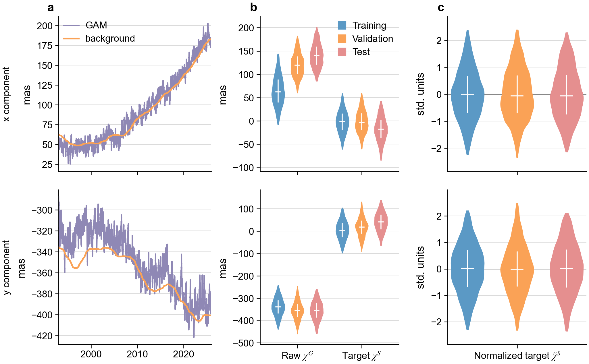
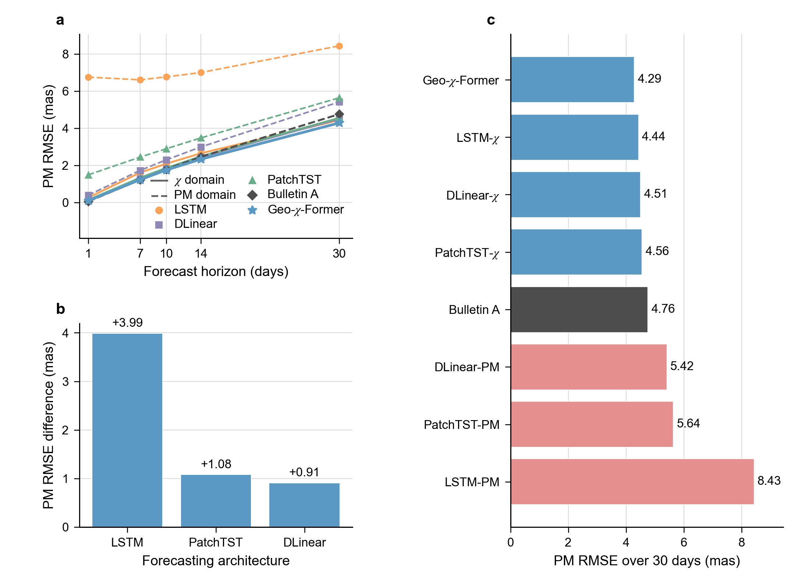
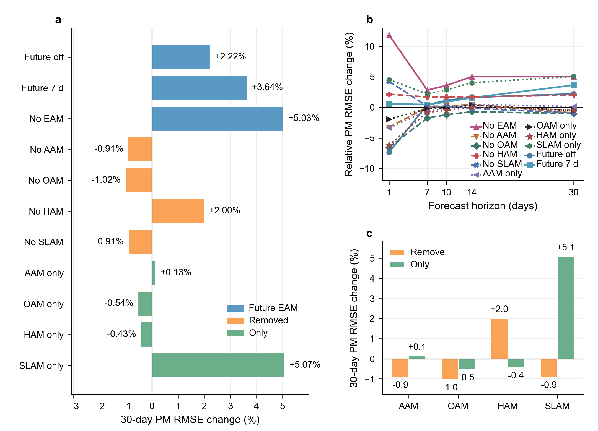
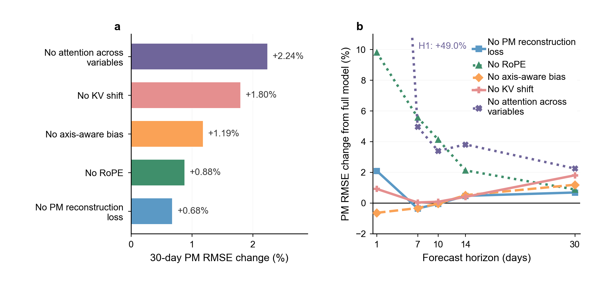
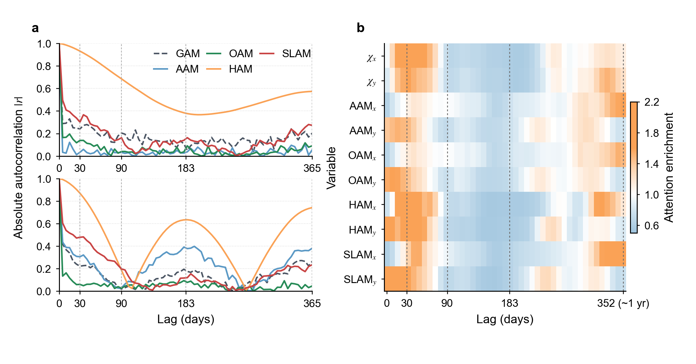
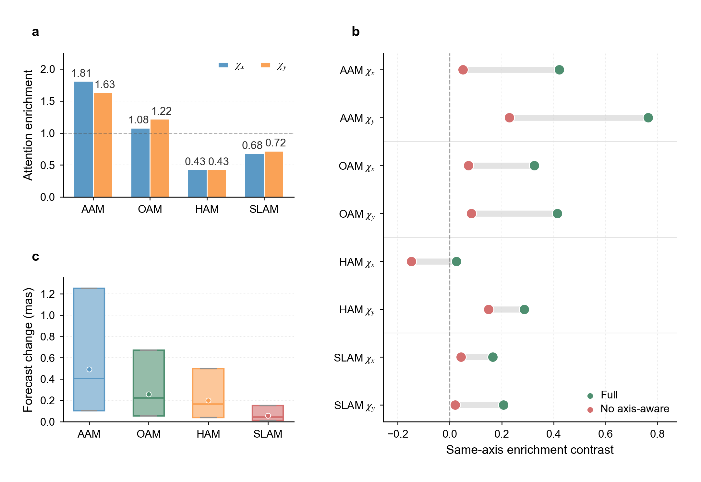

# Geo-chi-Former

Core source code and figure previews for:

> Junhai Huang, Boyang Zhu, and Xiaodong Liu. “Geo-chi-Former: A Geodynamically Constrained Excitation-Domain Transformer for Short-Term Polar Motion Prediction.” Manuscript prepared for *Journal of Geophysical Research: Solid Earth*.

Geo-chi-Former forecasts short-term polar motion in the geophysical angular-momentum excitation domain. This compact repository presents the model architecture, the data loader, the Wilson excitation–polar-motion conversion, and the figures generated for the manuscript.

## Contents

| Path | Description |
|---|---|
| `models/chiformer.py` | Geo-chi-Former architecture |
| `data/EOP_loader.py` | PM/EAM dataset construction and preprocessing |
| `data/eop_core.py` | Shared excitation-domain data functions |
| `utils/integrator.py` | Wilson inversion and polar-motion reconstruction |
| `data/example_eop_eam.csv` | Illustrative prepared-data CSV layout |
| `figures/previews/` | Generated manuscript figures |

Training workflows, experiment configurations, model checkpoints, plotting programs, and intermediate results are intentionally omitted. The retained Python files require PyTorch, NumPy, pandas, and scikit-learn; these dependencies are listed in `requirements.txt`.

## Data

The model uses daily polar motion from IERS and Earth angular-momentum products from GFZ/ESMGFZ and the ETH Zurich prediction comparison service. These third-party data are not redistributed here.

Download links, required units, column names, and preparation notes are provided in [`data/README.md`](data/README.md). The included [`data/example_eop_eam.csv`](data/example_eop_eam.csv) shows the daily column layout expected by the loader; its three rows and numeric values are illustrative only.

## Figures

### Figure 1 — Geo-chi-Former architecture

### Figure 2 — Distribution-shift treatment

### Figure 3 — Model comparison

### Figure 4 — EAM ablation

### Figure 5 — Structural ablation

### Figure 6 — Temporal interpretability

### Figure 7 — Source interpretability

## Citation and license

Citation metadata are provided in [`CITATION.cff`](CITATION.cff). The source code is released under the [Apache License 2.0](LICENSE). Upstream IERS, GFZ, and ETH Zurich data remain subject to their providers’ terms.
